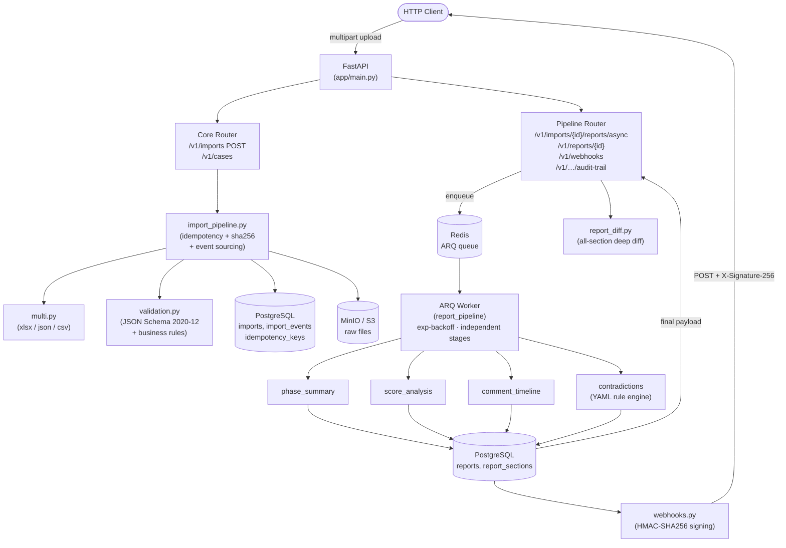

# SurgiNote Report Service

**Production-ready** FastAPI service for surgical video annotation ingestion, analysis, and structured report generation. Designed for clinical and enterprise deployment.

---

## Workbook contract (`xlsx`)

1. **Video Info** — `Property | Value` rows (`Video ID`, `Video Name`, `Duration`, `Export Version`, …).
2. **Phases** — `Phase Name`, times, frames, `Description`, `Phaco Method`, …
3. **Skills & Ratings** — per-skill scores; aggregate footer rows filtered out.
4. **Comments & Notes** — typed markers with `Video Time` / text.
5. **Raw Data (Technical)** — full `Annotation Data (JSON)` blob (source of truth for replay / enrichment).

---

## Internal persistence

- `cases` + `raw_payload` JSON.
- `case_phases`, `case_skills`, `case_comments`, `case_reports`.
- `imports`, `import_events`, `idempotency_keys` — event store + audit trail.
- `reports`, `report_sections` — async pipeline reports (schema 2.0).

---

## Flags policy

Env: `SN_FLAG_POLICY` (default `phase_window_then_case_wide`), `SN_CONTRADICTION_SCORE_RATIO_THRESHOLD` (default `0.8`).

---

## Report JSON schema (high level)

- `meta`: `schema_version`, **`report_locale`** (`en`|`fa`), `export_version`, `video_*`, `generated_at`, `sources`, thresholds.
- `sections.phase_summary.items`
- `sections.score_analysis`: `overall`, `per_skill_means`, **`score_narrative`**
- `sections.comments_timeline`
- `sections.contradictions.flags`
- `quality.limitations`

---

## HTTP API

### Core import & case management

| Method | Path | Notes |
|--------|------|--------|
| `POST` | `/v1/imports` | multipart `upload` — `.xlsx`/`.xlsm`/`.json`/`.csv`; `X-Idempotency-Key`; SHA-256; audit events |
| `GET` | `/v1/cases/{case_id}` | normalized case + relations |
| `POST` | `/v1/cases/{case_id}/reports/generate` | query: `locale` (`en`|`fa`), `persist` (default `true`) |
| `GET` | `/v1/cases/{case_id}/reports/latest` | last persisted report |
| `POST` | `/v1/narratives/generate` | body: `{ "report": {...}, "locale": "en"|"fa" }` + `GEMINI_API_KEY` |
| `POST` | `/v1/narratives/generate-from-report` | body: report JSON; query: `locale`, `extra_instructions` |
| `POST` | `/v1/cases/{case_id}/narratives/generate` | pulls report from DB |
| `GET` | `/healthz` | liveness |
| `GET` | `/readyz` | DB readiness |

### Event pipeline & async reports

| Method | Path | Notes |
|--------|------|--------|
| `GET` | `/v1/imports/{id}/audit-trail` | append-only event log; `?format=csv` for CSV export |
| `POST` | `/v1/imports/{id}/reports/async` | 4-stage pipeline (ARQ or `SN_SYNC_JOBS=true`) |
| `GET` | `/v1/reports/{id}/status` | stage progress + `duration_ms` + `estimated_completion` |
| `GET` | `/v1/reports/{id}` | schema **2.0** final report |
| `GET` | `/v1/reports/{a}/diff/{b}` | deep diff across all sections |
| `POST` | `/v1/reports/{id}/regenerate` | rule/threshold override |
| `POST` | `/v1/webhooks` | register `report.completed` / `report.failed` / `import.completed` |

See **`docs/ARCHITECTURE.md`** and **`docker-compose.yml`** for service topology.

---

## Architecture diagram



---

## Project layout

```
app/
  main.py                  # ASGI app + middleware + lifespan
  config.py                # Pydantic settings (SN_* env vars)
  domain/                  # canonical, errors, events, hashing, security, validation
  application/             # import_pipeline, report_jobs, report_diff, rules/, analyzers/
  infrastructure/          # database/, excel/, llm/, parsers/, queue/, secrets/, storage/
  api/                     # router.py (core), pipeline_router.py, errors.py, schemas.py
config/
  contradiction_rules.yaml
schemas/
  canonical.schema.json
tests/
  unit/                    # test_analyzers, test_rule_engine, test_security, test_validation
  integration/             # test_import_pipeline, test_edge_cases, test_security_features
scripts/
  smoke_test.sh
alembic/
  versions/001_initial_schema.py
docs/
  ARCHITECTURE.md
docker-compose.yml
Dockerfile
.env.example
```

---

## Quick start (local)

```bash
docker compose up -d postgres redis minio
cp .env.example .env
pip install -r requirements.txt
python -m uvicorn app.main:app --reload --host 0.0.0.0 --port 8000
# async worker (skip with SN_SYNC_JOBS=true)
arq app.infrastructure.queue.worker.WorkerSettings
```

### Environment (`.env` from `.env.example`)

| Variable | Default | Purpose |
|----------|---------|---------|
| `SN_DATABASE_URL` | PostgreSQL URL | Primary database |
| `SN_REDIS_URL` | `redis://localhost:6379/0` | ARQ queue |
| `SN_S3_ENDPOINT_URL` | `http://localhost:9000` | Object storage |
| `SN_REPORT_LOCALE` | `en` | `en`\|`fa` default report language |
| `SN_CONTRADICTION_SCORE_RATIO_THRESHOLD` | `0.8` | Flag threshold |
| `SN_FLAG_POLICY` | `phase_window_then_case_wide` | Detection scope |
| `GEMINI_API_KEY` | — | Narrative generation |
| `SN_SYNC_JOBS` | `false` | Inline stages (dev/test) |
| `SN_SKIP_OBJECT_STORAGE` | `false` | Bypass MinIO (dev/test) |
| `SN_RATE_LIMIT` | `60/minute` | Per-IP rate limit |

### Tests

```bash
pytest tests -q                           # all tests
pytest tests/unit -q                      # unit: rules, analyzers, validation, security
pytest tests/integration -q              # integration: pipeline, edge-cases, security
pytest tests --cov=app --cov-report=html  # coverage report
```

---

## Security

- Security headers on every response (`nosniff`, `X-Frame-Options: DENY`, XSS, Referrer-Policy)
- `X-Request-ID` tracing on every request
- Rate limiting per IP (`slowapi`)
- CORS configurable via `SN_CORS_ORIGINS`
- Filename sanitization: path traversal stripped, null bytes removed, 255-char cap
- Webhook secret: min 16 chars, HMAC-SHA256 signed outbound calls
- Secrets via `SN_SECRET_PROVIDER=env|mapped` (extend for Vault/AWS Secrets Manager)
- No internal details in 500 responses

---

*README v3.0 — report JSON localized via `report_locale`.*
