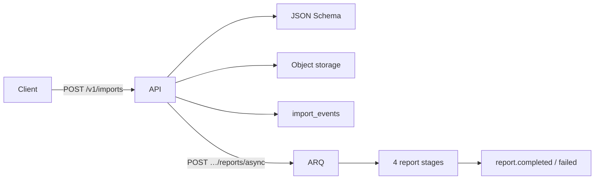

# SurgiNote Report Service — Architecture

## Stack

| Area | Choice |
|------|--------|
| DB | PostgreSQL (`SN_DATABASE_URL`) |
| Queue | ARQ + Redis |
| Storage | MinIO / S3 (`boto3`, lazy import) |
| Idempotency | `idempotency_keys` table, 24h TTL, `X-Idempotent-Replay` |
| Secrets | `SecretProvider` — `SN_SECRET_PROVIDER=env|mapped` |
| Rules | `config/contradiction_rules.yaml` |

## Event Flow



## API

| Method | Path |
|--------|------|
| `POST` | `/v1/imports` — `X-Idempotency-Key`, xlsx/json/csv, max 50MB |
| `GET` | `/v1/imports/{id}/audit-trail?format=json\|csv` |
| `POST` | `/v1/imports/{id}/reports/async` |
| `GET` | `/v1/reports/{id}/status` |
| `GET` | `/v1/reports/{id}` |
| `GET` | `/v1/reports/{a}/diff/{b}` |
| `POST` | `/v1/reports/{id}/regenerate` |
| `POST` | `/v1/webhooks` |
| `GET` | `/readyz` |

Legacy endpoints: `/v1/cases/...`, `/v1/narratives/...` — schema **1.3.0** on `case_reports`.  
Async pipeline reports — schema **2.0** on `reports` + `report_sections`.

## Tests

```powershell
pytest tests/unit -q          # rules, analyzers, validation, security
pytest tests/integration -q   # idempotency, pipeline, edge cases
pytest tests -q               # all
pytest tests --cov=app --cov-report=html
```

## Local Dev

```powershell
docker compose up -d postgres redis minio
copy .env.example .env
pip install -r requirements.txt
uvicorn app.main:app --reload
arq app.infrastructure.queue.worker.WorkerSettings   # unless SN_SYNC_JOBS=true
```

## Security Notes

- All responses carry `X-Content-Type-Options: nosniff`, `X-Frame-Options: DENY`, `X-XSS-Protection`, `Referrer-Policy` headers
- Filename sanitization: path traversal stripped, null bytes removed, 255-char cap
- Webhook secret: min 16 chars, only `report.completed|report.failed|import.completed` events
- HMAC-SHA256 signing on all outbound webhook calls
- Rate limiting: `slowapi` enforced per-client (configurable `SN_RATE_LIMIT`)
- Idempotency caches failures; replay returns same status with `X-Idempotent-Replay: true`
- Structured JSON logging; secrets never emitted to logs
- Request-ID tracing via `X-Request-ID` header

## GitHub

Use a **private** repository.
